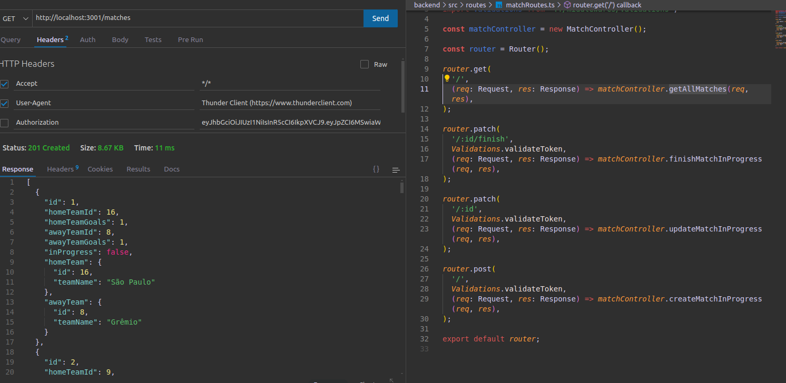

#  Trybe Futebol Clube 

## 🌐 [](https://github.com/SamuelRocha91/trybeFutebolClube/blob/main/README.md) [](https://github.com/SamuelRocha91/trybeFutebolClube/blob/main/README_es.md) [](https://github.com/SamuelRocha91/trybeFutebolClube/blob/main/README_en.md) [](https://github.com/SamuelRocha91/trybeFutebolClube/blob/main/README_ru.md) [](https://github.com/SamuelRocha91/trybeFutebolClube/blob/main/README_ch.md) [](https://github.com/SamuelRocha91/trybeFutebolClube/blob/main/README_ar.md)



<details>
  <summary><h2>📄 الوصف</h2></summary>

  **Trybe Futebol Clube** هو تطبيق لإدارة مباريات كرة القدم تم تطويره كجزء من وحدة خلفية في دورة تطوير الويب في Trybe. يتيح هذا المشروع للمستخدمين إدارة المباريات والفرق والصفوف بطريقة بسيطة وفعالة، باستخدام خلفية قوية ومُعتمدة على الحاويات (Docker).

</details>

<details>
  <summary><h2>✨ الميزات</h2></summary>

  - **إدارة المباريات**: إنشاء وتحديث وإنهاء المباريات الجارية.
  - **إدارة الفرق**: تسجيل ومعالجة المعلومات حول فرق كرة القدم.
  - **نظام تسجيل الدخول**: مصادقة المستخدمين لضمان أمان وسلامة البيانات.
  - **التصنيف**: الحصول على معلومات حول تصنيف الفرق بطريقة سهلة الفهم.

</details>

<details>
  <summary><h2>🛠️ التقنيات المستخدمة</h2></summary>

  - **Node.js**: بيئة تشغيل لجافا سكريبت على جانب الخادم.
  - **Express**: إطار عمل لبناء واجهات برمجة التطبيقات (APIs) RESTful.
  - **Sequelize**: ORM (خرائط كائنات العلاقات) لمعالجة قواعد البيانات.
  - **Docker**: لتعبئة التطبيق، مما يسهل إعداد وإدارة التبعيات.
  - **TypeScript**: لزيادة الجودة والصيانة من خلال التحقق من الأنواع الثابتة.

</details>

<details>
  <summary><h2>📑 هيكل الطرق</h2></summary>

  تحتوي واجهة برمجة التطبيقات على الطرق التالية:

  - **الفرق**
    - `GET /teams`: استرداد جميع الفرق.
    - `POST /teams`: إنشاء فريق جديد.

  - **تسجيل الدخول**
    - `POST /login`: إجراء مصادقة المستخدم.

  - **المباريات**
    - `GET /matches`: استرداد جميع المباريات.
    - `POST /matches`: إنشاء مباراة جديدة.
    - `PATCH /matches/:id`: تحديث مباراة جارية.
    - `PATCH /matches/:id/finish`: إنهاء مباراة جارية.

  - **التصنيف**
    - `GET /leaderboard`: استرداد تصنيف الفرق.

</details>

<details>
  <summary><h2>🚀 التثبيت</h2></summary>

  1. استنساخ المستودع:

     ```bash
     git clone git@github.com:SamuelRocha91/trybeFutebolClube.git
     cd trybe-futebol-clube
     ```

  2. تثبيت التبعيات:

     ```bash
     npm install
     ```

  3. تكوين Docker:

     - تأكد من تثبيت Docker وتشغيله على جهازك.
     - يمكنك استخدام `docker-compose` لبدء الخدمات المطلوبة.

  4. لتشغيل التطبيق، استخدم الأمر:

     ```bash
     cd app
     docker-compose up --build
     ```

     سيتم بدء تشغيل التطبيق على المنفذ المحدد بواسطة متغير البيئة `APP_PORT`، مع افتراضي 3001.

</details>

<details>
  <summary><h2>🔗 المستودعات ذات الصلة</h2></summary>

  - 🗡️ [Trybe Smith](https://github.com/SamuelRocha91/TrybeSmith/blob/main/README_ar.md)
  - 🪧 [Blogs Api](https://github.com/SamuelRocha91/BlogsApi/blob/main/README_ar.md)
  - 🐉 [Trybers and Dragons](https://github.com/SamuelRocha91/trybeAndDragons/blob/main/README_ar.md)

</details>
